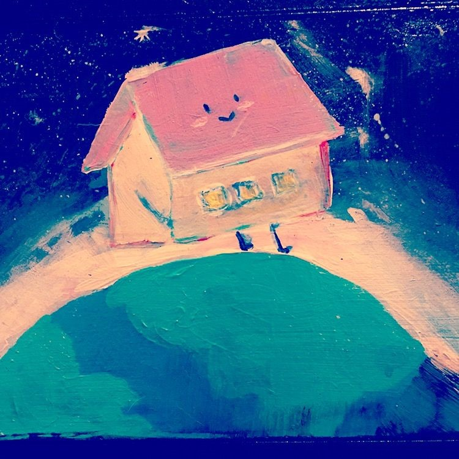

# back-home

Since Nov 2019, I've had a desire to create a story for my nieces and nephew about a house floating through space searching for its home. My hope for the 2nd month of my one-game-one-month challenge is to follow through with completing the story using a visual novel format.

## Resources Used
[Ren'Py](https://www.renpy.org/) - Visual novel and life simulation game engine. 
[Shawna (aka Feniks Dev)](https://feniksdev.itch.io/) 
 